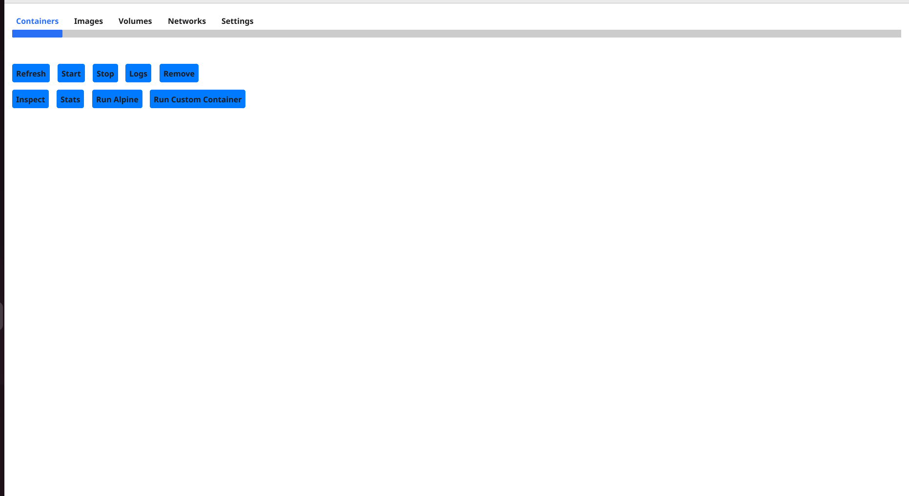

# docker-dashboard
Portainer for the desktop! "Finally"!

A lightweight desktop application for managing Docker containers, images, volumes, and networks using the Fyne UI toolkit.



## Features

- **Container Management**: List, start, stop, inspect, and remove containers
- **Image Management**: List, pull, and remove Docker images
- **Volume Management**: Create and manage Docker volumes
- **Network Management**: Create and manage Docker networks
- **Live Container Stats**: View CPU and memory usage of running containers
- **Container Logs**: Access and view container logs
- **Quick Actions**: Run Alpine containers with a single click
- **Custom Containers**: Create and run custom containers with environment variables and port mapping
- **TLS Support**: Connect to remote Docker daemons with TLS certificates

## Installation

### Prerequisites

- Go 1.16+
- Docker Engine
- Fyne dependencies (see [Fyne getting started](https://developer.fyne.io/started/))

### Build from Source

1. Clone the repository:
```bash
git clone https://github.com/cardoza1991/docker-dashboard.git
cd docker-dashboard
```

2. Install dependencies:
```bash
go mod download
```

3. Build the application:
```bash
go build
```

4. Run the application:
```bash
./docker-dashboard
```

### Binary Releases

Pre-built binaries for Windows, macOS, and Linux are available on the [Releases](https://github.com/yourusername/docker-dashboard/releases) page.

## Usage

### Connection Settings

By default, the application connects to the local Docker daemon using the Unix socket at `/var/run/docker.sock`. For Windows, it uses the named pipe.

To connect to a remote Docker daemon:

1. Go to the "Settings" tab
2. Update the Docker Host field (e.g., `tcp://192.168.1.100:2375`)
3. For TLS connections, provide paths to your CA, certificate, and key files
4. Click "Submit" to apply changes

### Managing Containers

- **List Containers**: The Containers tab shows all containers (running and stopped)
- **Start/Stop**: Select a container and click the respective button
- **Logs**: View container logs by selecting a container and clicking "Logs"
- **Inspect**: View detailed container information
- **Stats**: Monitor container resource usage
- **Remove**: Delete containers (force removal is applied)

### Working with Images

- **Pull Images**: Click "Pull Image" and enter the image name/tag
- **Remove Images**: Select an image and click "Remove Image"

### Volumes and Networks

Similar interfaces are provided for managing Docker volumes and networks with options to create and remove resources.

## Custom Containers

To run a custom container:

1. Click "Run Custom Container" on the Containers tab
2. Enter the image name (e.g., `nginx:latest`)
3. Specify command (if needed)
4. Add environment variables in the format `KEY=value,ANOTHER=value`
5. Map ports in the format `8080:80,8443:443`

## License

[MIT License](LICENSE)

## Contributing

Contributions are welcome! Please feel free to submit a Pull Request.

1. Fork the repository
2. Create your feature branch (`git checkout -b feature/amazing-feature`)
3. Commit your changes (`git commit -m 'Add some amazing feature'`)
4. Push to the branch (`git push origin feature/amazing-feature`)
5. Open a Pull Request

## Acknowledgments

- [Fyne](https://fyne.io/) - Cross-platform GUI toolkit
- [Docker Engine API](https://docs.docker.com/engine/api/) - Docker API client
- [Docker Go Client](https://github.com/docker/docker) - Official Docker Go client
